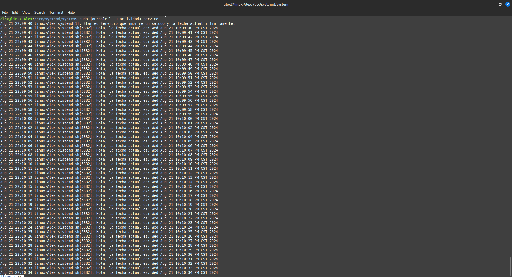

# Servicio de Saludo y Fecha

Este servicio `systemd` ejecuta un script en Bash que imprime un saludo y la fecha actual de manera infinita, con una pausa de un segundo entre cada impresión.

## Instalación

1. **Crear el script**: `actividad4.sh` a `/home/alex/Desktop/Sopes1/so1_actividades_202210266/actividad4` y dale permisos de ejecución.
   
   ```bash
   #!/bin/bash
    while true; do
        echo "Hola, la fecha actual es: $(date)"
        sleep 1
    done
   ```
   ```bash
   sudo chmod +x /home/alex/Desktop/Sopes1/so1_actividades_202210266/actividad4/actividad4.sh
    ```
2. **Crear el archivo de unit**: Crea el archivo unit en `/etc/systemd/system/actividad4.service` con el contenido proporcionado.

   ```bash
   [Unit]
    Description=Servicio que imprime un saludo y la fecha actual infinitamente

    [Service]
    ExecStart=/usr/local/bin/mi_script.sh
    Restart=always

    [Install]
    WantedBy=multi-user.target
   ```
3. **Habilitar el servicio:**: Habilita el servicio para que se inicie automáticamente con el sistema
    ```bash
    sudo systemctl enable actividad4.service
    ```

4. **Iniciar el servicio:**:Inicia el servicio manualmente por primera vez:
    ```bash
    sudo systemctl start actividad4.service

    ```
## Ver los logs del servicio
1. **Comando para ver los logs:**
    ```bash
    sudo journalctl -u mi_servicio.service
    ```
