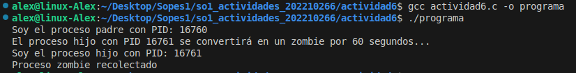
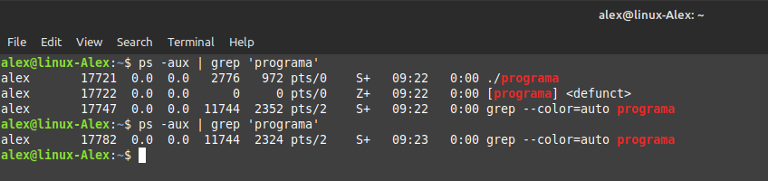
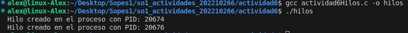

# Actividad 6
## ¿Incluyendo el proceso inicial, cuantos procesos son creados por el siguiente programa?

El programa original crea un número total de `8 procesos`, incluyendo el proceso original. Vamos a desglosar el razonamiento.

### Razonamiento paso a paso:

1. **Proceso original**: Cuando el programa empieza, hay un único proceso ejecutando el código (proceso padre inicial).

2. **Primera llamada a `fork()`**:
   - La primera llamada a `fork()` crea un nuevo proceso.
   - Ahora hay 2 procesos en total (el proceso original y el nuevo proceso hijo).

3. **Segunda llamada a `fork()`**:
   - Ambos procesos (el original y el que fue creado por la primera llamada a `fork()`) ejecutan esta segunda llamada a `fork()`, por lo tanto, cada uno crea un nuevo proceso.
   - Ahora hay 4 procesos en total.

4. **Tercera llamada a `fork()`**:
   - Todos los 4 procesos actuales (el original y los 3 creados por las dos llamadas anteriores a `fork()`) ejecutan esta tercera llamada a `fork()`, creando un nuevo proceso cada uno.
   - Esto produce 4 procesos adicionales.
   - Ahora hay 8 procesos en total.
## Utilizando un sistema Linux, escriba un programa en C que cree un proceso hijo (fork) que finalmente se convierta en un proceso zombie.

## Explicación Codigo actividad6.c:

1.  El proceso padre crea un proceso hijo con fork().
2.  El hijo imprime su PID y luego llama a exit(0) para finalizar inmediatamente.
3.  El padre imprime su PID y luego espera 60 segundos con sleep(60) sin llamar a wait(). Durante este tiempo, el hijo ha terminado, pero su estado de proceso no ha sido recogido por el padre, convirtiéndose en un proceso zombie.
### Compilacion actividad6.c

### Proceso zombie en consola

## Usando el siguiente código como referencia, completar el programa para que sea ejecutable y responder las siguientes preguntas:

### Explicación del Código

1. **Primer `fork()`**:
   - Crea un nuevo proceso hijo.
   - Ahora tienes dos procesos en total: el proceso original y el hijo.
   - Ambos procesos continúan ejecutando el código después del primer `fork()`.

2. **Dentro del Proceso Hijo (PID 2)**:
   - El bloque `if (pid == 0)` es verdadero solo para el proceso hijo.
   - Solo el proceso hijo (PID 2) ejecuta el código dentro de este bloque.

3. **Dentro del Proceso Hijo (PID 2)**:
   - **Segundo `fork()`**: Crea un nuevo proceso (PID 3), llamado proceso nieto.
   - Ahora tienes tres procesos en total: el original, el hijo y el nieto.

4. **Creación del Hilo**:
   - La llamada a `pthread_create()` ocurre solo en el proceso hijo (PID 2).
   - El proceso nieto (PID 3) no ejecuta `pthread_create`.

5. **Tercer `fork()`**:
   - Se ejecuta en todos los procesos actuales (PID 1, PID 2 y PID 3).
   - Crea tres nuevos procesos: PID 4, PID 5 y PID 6.
   - Ahora tienes un total de seis procesos.
   - Después del tercer `fork()`, el primer hijo se clona en otro proceso, y como ese proceso es una copia exacta del primer hijo, también incluye la ejecución del hilo.

### Respuestas a las Preguntas

- **¿Cuántos procesos únicos son creados?**
  - Proceso original (PID 1)
  - Proceso hijo (PID 2)
  - Proceso nieto (PID 3)
  - Proceso creado por el tercer `fork()` desde PID 1 (PID 4)
  - Proceso creado por el tercer `fork()` desde PID 2 (PID 5)
  - Proceso creado por el tercer `fork()` desde PID 3 (PID 6)

  **Total: 6 procesos únicos.**

- **¿Cuántos hilos únicos son creados?**
  - Solo el proceso hijo (PID 2) crea un hilo.
  - El proceso nieto (PID 3) no ejecuta `pthread_create()`.
  - El proceso (PID4) solamente clona el hilo.

  **Total: 1 hilo único.**

  ### Compilacion actividad6Hilos.c
  