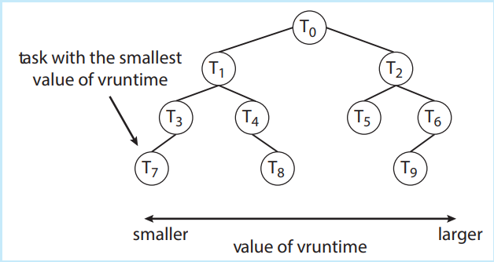

# Completely Fair Scheduler (CFS)

El **Completely Fair Scheduler (CFS)** es el algoritmo de planificación predeterminado del núcleo Linux, y su objetivo principal es asignar el tiempo de CPU de manera justa entre todas las tareas en ejecución. A continuación, se describen sus características clave y su funcionamiento:

## 1. Clases de planificación y prioridades
El sistema de planificación de Linux se organiza en **clases de planificación**, donde cada clase tiene asignada una prioridad específica. El núcleo utiliza estas clases para aplicar distintos algoritmos de planificación, adaptándose a diferentes necesidades del sistema. Existen dos clases de planificación implementadas en los núcleos estándar de Linux:
- **Clase de tiempo real**: diseñada para procesos que requieren ejecución inmediata.
- **Clase predeterminada**: utiliza el algoritmo CFS.

El planificador selecciona la tarea más prioritaria de la clase de mayor prioridad para ejecutarla. Nuevas clases de planificación pueden añadirse según sea necesario.

## 2. Asignación de tiempo de CPU
En lugar de usar segmentos de tiempo fijo como otros algoritmos, el CFS asigna una **proporción de tiempo de CPU** a cada tarea basada en el valor de **nice**. Los valores de nice varían de -20 a +19:
- Un valor de **nice** más bajo implica mayor prioridad, lo que otorga una mayor proporción de tiempo de CPU.
- Un valor de **nice** más alto reduce la prioridad, cediendo tiempo a otras tareas.

El valor predeterminado de **nice** es 0, lo que indica prioridad normal.

## 3. Latencia objetivo
CFS no utiliza valores discretos de "time slices" (segmentos de tiempo). En su lugar, identifica una **latencia objetivo**, que es un intervalo de tiempo en el que todas las tareas ejecutables deberían tener la oportunidad de ejecutarse al menos una vez. El tiempo de CPU asignado a cada tarea se distribuye dentro de este intervalo.

La latencia objetivo tiene un valor predeterminado y mínimo, pero puede aumentar si el número de tareas activas supera un cierto umbral.

## 4. Tiempo de ejecución virtual (vruntime)
El CFS rastrea cuánto tiempo ha ejecutado cada tarea mediante una variable llamada **tiempo de ejecución virtual (vruntime)**. Este valor se ajusta según la prioridad de la tarea:
- Las tareas de **menor prioridad** tienen una tasa de incremento de **vruntime** más rápida, lo que les da menos tiempo de CPU.
- Las tareas de **mayor prioridad** acumulan vruntime más lentamente, permitiéndoles ejecutarse más tiempo.

El planificador selecciona para su ejecución la tarea con el menor valor de **vruntime**.

## 5. Estructura de datos: Árbol Rojo-Negro
Para gestionar las tareas de forma eficiente, CFS utiliza un **árbol rojo-negro**, una estructura de datos de árbol binario balanceado. Las claves del árbol se basan en el valor de **vruntime**:
- Las tareas con **menor vruntime** (que han recibido menos tiempo de CPU) están en el lado izquierdo del árbol.
- Las tareas con **mayor vruntime** (que han recibido más tiempo) están a la derecha.

El nodo más a la izquierda del árbol tiene la **prioridad más alta**, lo que permite al planificador encontrar la siguiente tarea a ejecutar en **O(log N)**, donde N es el número de tareas en el árbol. Para mayor eficiencia, el núcleo almacena en caché la tarea con menor vruntime, haciendo que la selección de la próxima tarea sea aún más rápida.

## 6. Preempción
Una tarea de mayor prioridad puede **preemptar** (interrumpir) a una de menor prioridad si se vuelve ejecutable. Esto asegura que las tareas prioritarias no se vean retrasadas por tareas menos importantes.
